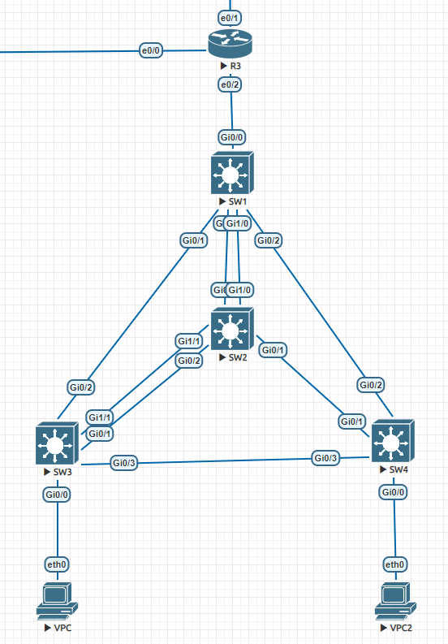
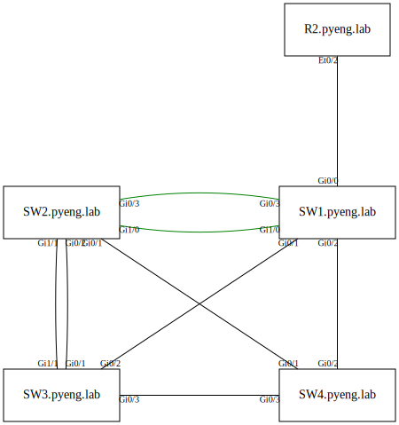

# Описание
Данный репозиторий содержит рещение финального задания марафона Cisco DevNet.

Скрипт опрашивает коммутаторы и маршрутизаторы циско, затем рисует топологию сети.

Входные данные:
  Т.к. програма для свойе работы использует фреймворк Nornir необходимо корректно заполнненные инвентарные файлы.
   - У каждого хоста обязательно должна быть заполнена его роль:
  ```sh
  ---
  SW1:
  hostname: 192.168.0.3
  port: 2021
  groups:
    - cisco
  data:
    role: core
  ```
    Данные о роли в дольнейшем используются для корректного позиционирования оборудования на отрисованной топологи.  

   - Должно быть заполненно корректное имя домена
  ```sh
  ---
  data:
    domain: test.lab
  ```    


Выходные данные:
 - файл с описанием топологии в формате yaml и бекап предыдущей топологии в том же формате, находятся в каталоге /data
 - графическое представление топологии в формате svg в директории /img


# Пример работы скрипта:

Реальная топология:



выполнение скрипта:
```sh
(Devnet) $ run.py
```

результат:



# Установка

  1) создаем виртулальное окружение
  2) устанавливаем зависимости из файла requirements.txt
  3) Запускаем файл run.py


# Логика работы

Cкрипт run.py импортирует и запускает две функции:
  1) функция get_topology из скрита get_topology.py
  2) функция draw_topology из скрипта draw_topology.py


Функция get_topology с помощью фреймворка nornir выполняет следующие действия:
 - проверяет включен ли lldp на устройствах 
 - При необходимости включает lldp и сохраняет конфигурацию
 - Отправляет на устройства команду sh lldp neighbors и парсит ее вывод
 - Записывает полученную топологию в yaml файл.
 - если в результате предыдущих запусков файл с топологией уже был создан то создается его бекап


 Пример yaml файла с топологией:
 ```sh
 ---
 R2.test.lab:
  neighbors:
  - capabilities: R
    local_interface: Et0/2
    neighbor: SW1
    neighbor_interface: Gi0/0
  role: wan
  ```


Функция draw_topology выполняет следующие действия:
 - читает yaml файл с топологией
 - читает yaml файл со старой топологией если есть
 - рисует графическое представление топологии с помощью библиотеки graphviz


# Сравнение с предыдущей топологией
- Если линка или ноды на предыдущей топологии небыло то они рисуется красным
- Ели линк или нода в предыдущей топологии были а теперь нету то рисуется зеленым  